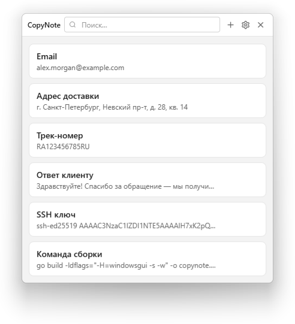

# CopyNote

[](https://go.dev/)
[](https://svelte.dev/)
[](https://tailwindcss.com/)
[](https://developer.microsoft.com/en-us/microsoft-edge/webview2/)
[](LICENSE)

Легковесная утилита для Windows, которая хранит часто используемые текстовые фрагменты (email, адреса, ID, шаблоны) и копирует их в буфер обмена одним кликом.

[English version](README.md)

<p align="center">
  <picture>
    <source media="(prefers-color-scheme: dark)" srcset="docs/screenshots/ru-dark.png">
    
  </picture>
</p>

## Возможности

- **Копирование в один клик** &mdash; нажмите на запись, и её значение окажется в буфере обмена
- **Управление записями** &mdash; создание, редактирование, удаление
- **Мгновенный поиск** &mdash; фильтрация по названию или значению прямо при вводе
- **Интеграция с треем** &mdash; живёт в области уведомлений, анимация выезда вверх/вниз
- **Автоскрытие при потере фокуса** &mdash; включено по умолчанию; кликните в другое окно, и CopyNote плавно свернётся, либо отключите это в настройках
- **Светлая и тёмная тема** &mdash; следует за системой или переключается вручную (палитра в стиле Win11)
- **Локализация** &mdash; английский и русский, автоопределение по языку системы
- **Импорт / Экспорт** &mdash; резервная копия всех записей и настроек в один JSON-файл, восстановление с мержем (дедупликация по label+value)
- **Автозапуск** &mdash; опциональный старт при входе в Windows (через реестр)
- **Единственный экземпляр** &mdash; повторный запуск поднимает уже работающее окно
- **Глобальная горячая клавиша** &mdash; настраиваемое сочетание (по умолчанию Ctrl+Alt+N) открывает или скрывает окно из любой программы; его можно отключить
- **Работа с клавиатуры** &mdash; Enter копирует верхнее совпадение поиска, стрелки перемещают фокус по списку, F2/Delete управляют выбранной записью
- **Контекстное меню записей** &mdash; правый клик, клавиша меню или Shift+F10 открывают копирование, редактирование, удаление и изменение порядка
- **Обновление в один клик** &mdash; в настройках видна новая версия; одна кнопка скачивает подписанную сборку, проверяет подпись и перезапускает приложение. Без установщика и прав администратора
- **Адаптивная иконка** &mdash; авто-переключение light/dark при смене темы; пульсация при загрузке
- **Тихий старт** &mdash; ни окна, ни иконки в панели задач во время инициализации WebView2
- **Портативное** &mdash; один `.exe`, установка не требуется
- **Лёгкое** &mdash; ~7 МБ бинарник, ~40 МБ RAM в простое

## Требования

- **Windows 10 (1809+) или Windows 11**
- **WebView2 Runtime** &mdash; предустановлен в Windows 11 и большинстве обновлённых Windows 10. Если отсутствует, скачайте [Evergreen Bootstrapper](https://developer.microsoft.com/en-us/microsoft-edge/webview2/#download).

## Быстрый старт

Скачайте `copynote.exe` из [Releases](https://github.com/DiHard/CopyNote/releases) и запустите. Всё &mdash; ни установщика, ни зависимостей кроме WebView2.

Следующие версии устанавливаются из *Настройки → Обновления* одной кнопкой: приложение проверяет GitHub Releases при старте (можно отключить), скачивает новый `copynote.exe` рядом с работающим, проверяет подпись ed25519 и перезапускается.

При ручном запуске окно открывается, как только готов WebView2. При входе в Windows через автозапуск приложение запускается тихо в трее. Левый клик по иконке в трее переключает видимость окна.

## Сборка из исходников

### Необходимо

| Инструмент | Версия |
|-----------|--------|
| [Go](https://go.dev/dl/) | 1.25+ |
| [Node.js](https://nodejs.org/) | 22+ (только для сборки фронтенда) |

### Шаги

```bash
# 1. Клонировать
git clone https://github.com/DiHard/CopyNote.git
cd CopyNote

# 2. Собрать фронтенд (Svelte + Tailwind → один HTML-файл)
cd web
npm ci
npm run build
cd ..

# 3. Собрать Go-бинарник
go build -ldflags="-H=windowsgui -s -w" -o copynote.exe .
```

Полученный `copynote.exe` полностью самодостаточен (фронтенд встроен через `//go:embed`).

### Перегенерация иконки

Иконка трея/exe генерируется из кода (контур Lucide "copy"):

```bash
go run tools/genicon/main.go          # создаёт assets/icon-dark.ico + icon-light.ico
./bin/rsrc.exe -ico "assets/icon-dark.ico,assets/icon-light.ico" -arch amd64 -o resource_windows_amd64.syso
```

## Хранение данных

| Что | Где |
|-----|-----|
| Записи и настройки | `%APPDATA%\CopyNote\data.json` |
| Предыдущая сохранённая версия | `%APPDATA%\CopyNote\data.json.bak` |
| Журнал диагностики | `%LOCALAPPDATA%\CopyNote\copynote.log` |
| Кэш WebView2 | `%LOCALAPPDATA%\CopyNote\WebView2\` |

Рядом с исполняемым файлом ничего не хранится &mdash; можно положить куда угодно.

## Технологический стек

| Слой | Технология |
|------|-----------|
| Бэкенд | Go (stdlib + [go-webview2](https://github.com/jchv/go-webview2)) |
| Фронтенд | Svelte 5, TypeScript, Tailwind CSS 4 |
| Сборщик | Vite + vite-plugin-singlefile |
| UI-хост | Microsoft Edge WebView2 |
| Системная интеграция | Win32 API через `golang.org/x/sys/windows` (без cgo) |

## Горячие клавиши

| Клавиша | Контекст | Действие |
|---------|----------|----------|
| `Ctrl+Alt+N` | Любая программа | Переключить окно (сочетание можно изменить или отключить в настройках) |
| `Escape` | Поиск / главное окно | Очистить поиск; при пустом поиске скрыть окно в трей |
| `Escape` | Настройки | Вернуться к списку записей |
| `Escape` | Любой диалог | Закрыть диалог |
| `Enter` | Поиск | Скопировать верхнее совпадение и скрыть окно при успешном копировании |
| `Enter` | Форма создания/редактирования | Сохранить |
| `Enter` | Подтверждение удаления | Нажать выбранную кнопку; начальный фокус на «Отмена» |
| `↓` | Поиск | Переместить фокус на первую запись |
| `↑` / `↓` | Выбранная запись | Перемещать фокус по списку записей |
| `F2` | Выбранная запись | Редактировать запись |
| `Delete` | Выбранная запись | Удалить запись |
| `Ctrl+↑` / `Ctrl+↓` | Выбранная запись | Переместить запись вверх или вниз |
| `Tab` | Главное окно | Переход между поиском, списком и кнопками шапки; список занимает одну остановку Tab |
| Клавиша меню / `Shift+F10` | Выбранная запись | Открыть контекстное меню записи |

## Лицензия

[MIT](LICENSE)

## Надёжность и совместимость

Формат данных 2 сохраняет записи и настройки одним снимком. Данные формата 1
и прежний settings.json читаются автоматически; переход происходит при следующем
успешном сохранении. Старый файл настроек остаётся на диске, но источником
настроек становится data.json. После перехода используйте эту или более новую
совместимую версию: прежние exe не понимают объединённое хранение настроек.

Перед заменой данных предыдущий корректный снимок сохраняется в data.json.bak.
Если при запуске данные не читаются, приложение предлагает восстановить корректную
резервную копию и сохраняет исходный файл как data.json.corrupt-TIMESTAMP.
Восстанавливается предыдущее сохранённое состояние — последнее изменение может
отсутствовать. Если корректной копии нет, диалог сообщает путь к данным; файл
не сбрасывается в пустой список.

Импорт проверяет резервную копию до изменения данных. Старые экспорты поддерживаются;
в новые добавлено поле formatVersion. Отмена импорта или экспорта не считается
успехом. При пустом значении записи копируется её название.

## Проверки разработки

Из корня репозитория:

```powershell
go test ./...
go vet ./...
```

В каталоге web/: npm ci, npm run check, npm test, npm run build. Тесты фронтенда
проверяют реальный модуль состояния Svelte с подменённым мостом Go. Пользовательские
данные, реестр и буфер обмена не затрагиваются. Windows CI выполняет эти проверки,
проверяет актуальность встроенного web/dist и собирает exe.

Происхождение локальных зависимостей и порядок их обновления описаны в
[third_party/DEPENDENCIES.md](third_party/DEPENDENCIES.md).
